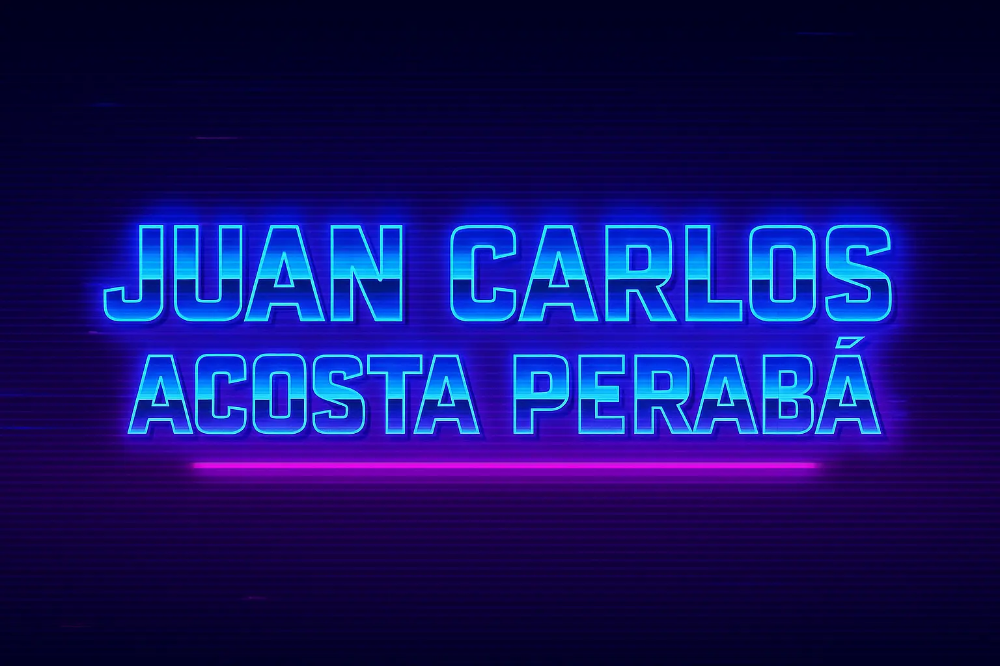

<div align="center">



<p align="center">

<a href="https://www.linkedin.com/in/juancarlosacostaperaba/">
  
</a>
<a href="https://www.uoc.edu/es/estudios/masters/master-universitario-ciberseguridad-privacidad">
  
</a>

<br>

<a href="https://github.com/JuanCarlosAcostaPeraba?tab=repositories">
 
</a>

</p>

<p align="center">

<a href="https://www.linkedin.com/in/juancarlosacostaperaba/">
 
</a>
<a href="mailto:juancarlos.ap.dev@gmail.com">
 
</a>
<a href="https://twitter.com/jcap_dev">
 
</a>
<a href="https://github.com/JuanCarlosAcostaPeraba">
 
</a>

</p>

</div>

## 💎 Personal Traits

```json
{
 "mindset": "Building impactful solutions in collaborative environments",
 "softSkills": {
  "rugby": {
   "description": "Discipline | Teamwork | Resilience",
   "impact": "Applied to software development and team collaboration"
  },
  "teaching": {
   "experience": "3 years university level",
   "subjects": "Programming Fundamentals & Computer Architecture",
   "skills": "Communication | Mentoring | Knowledge transfer"
  }
 },
 "languages": {
  "english": "B2 Certified (EOI)",
  "spanish": "Native"
 },
 "achievements": {
  "honorDistinction": {
   "subject": "Native Mobile App Programming",
   "year": "4th year, ULPGC"
  }
 },
 "personality": {
  "approach": "Collaborative and solution-oriented",
  "learning": "Continuous improvement mindset",
  "values": "Quality code | Team success | Innovation"
 }
}
```

## 📊 GitHub Activity

<div align="center">
  
  
</div>

## 💾 Tech Arsenal

### 🚀 **Languages & Frameworks**

<div align="center">


</div>

### 🛠️ **Tools & Platforms**

<div align="center">


</div>

### 📋 **Methodologies**

<div align="center">


</div>

## 🏆 Completed Objectives

<table>
<tr>
<td width="50%">

### 🎮 **GAMIFICATION APP**

```diff
+ FINALIST - Web Dev Competition
+ Fundación MAPFRE Guanarteme
```

**TECH STACK:**

- `HTML` `CSS` `JavaScript`
- `XML` `SCORM`

**STATUS:** ✅ DEPLOYED

🔗 [**LIVE DEMO**](https://jivanu-inc.github.io/gamificacion/) • [**SOURCE CODE**](https://github.com/JIVANU-Inc/gamificacion)

</td>
<td width="50%">

### 📲 **QUICKBILL-APP (TFG)**

```diff
+ GRADE: 9/10
+ Final Degree Project
```

**TECH STACK:**

- `Swift` (iOS Native)
- `Firebase` (Backend)
- `MVVM` Architecture
- `Astro` (Analytics Dashboard)

**FEATURES:**

- Billing & invoice management
- Real-time analytics
- Cloud synchronization

**STATUS:** ✅ COMPLETED

🔗 [**REPOSITORY**](https://github.com/JuanCarlosAcostaPeraba/QuickBill-App)

</td>
</tr>
</table>

<div align="center">


</div>
